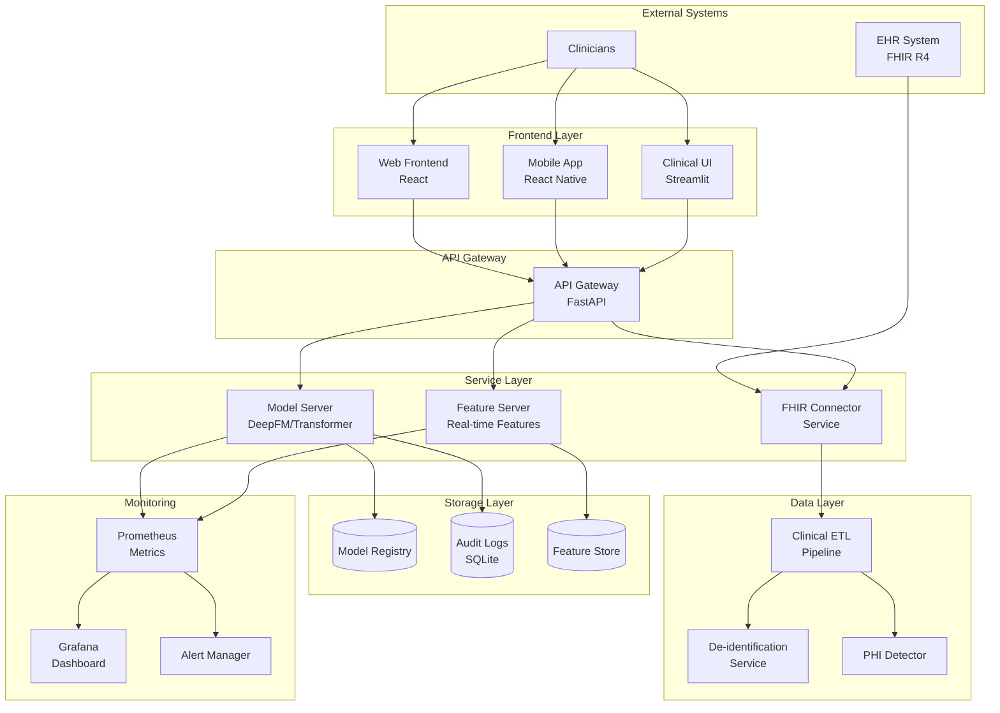
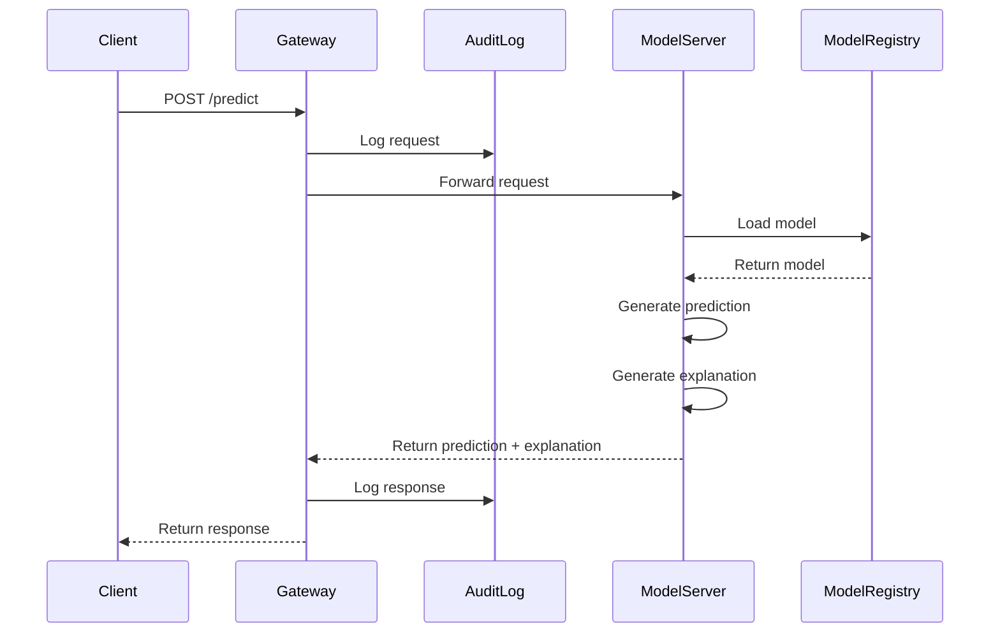
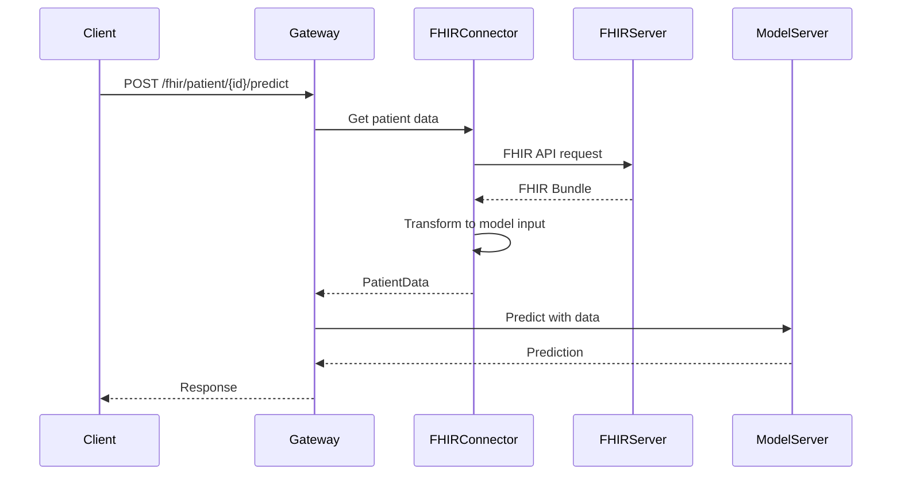

# Architecture

Nexora system architecture, component interactions, and design patterns.

## Table of Contents

- [System Overview](#system-overview)
- [High-Level Architecture](#high-level-architecture)
- [Component Architecture](#component-architecture)
- [Data Flow](#data-flow)
- [Deployment Architecture](#deployment-architecture)
- [Technology Stack](#technology-stack)

---

## System Overview

Nexora is a microservices-based healthcare ML platform consisting of:

- **API Layer**: REST and gRPC interfaces for predictions
- **Model Layer**: Multiple ML models with registry
- **Data Layer**: ETL pipelines with FHIR integration
- **Compliance Layer**: HIPAA audit logging and PHI protection
- **Monitoring Layer**: Metrics, logging, and alerting
- **Interface Layer**: Web, mobile, and clinical UIs

---

## High-Level Architecture



---

## Component Architecture

### API Gateway (`code/serving/rest_api.py`)

**Purpose**: Central entry point for all client requests

**Responsibilities**:

- Request routing and validation
- Authentication and authorization
- Rate limiting
- Audit logging
- Response formatting

**Key Functions**:

```python
@app.get("/health")              # Health check
@app.get("/models")              # List models
@app.post("/predict")            # Prediction endpoint
@app.post("/fhir/patient/{id}/predict")  # FHIR integration
```

---

### Model Server (`code/model_factory/`)

**Purpose**: ML model hosting and inference

**Components**:

- `model_registry.py`: Model versioning and loading
- `base_model.py`: Abstract base for all models
- `deep_fm.py`: DeepFM implementation
- `transformer_model.py`: Transformer implementation
- `survival_analysis.py`: Survival analysis models

**Architecture**:

```
ModelRegistry
    ├── get_model(name, version)
    ├── register_model()
    └── list_models()

BaseModel (Abstract)
    ├── predict(data) → predictions
    ├── explain(data) → explanations
    ├── train(data)
    └── evaluate(data) → metrics

DeepFMModel extends BaseModel
TransformerModel extends BaseModel
SurvivalModel extends BaseModel
```

---

### FHIR Connector (`code/utils/fhir_connector.py`)

**Purpose**: Interface with FHIR servers

**Features**:

- FHIR R4 resource parsing
- OAuth2 authentication
- Pagination handling
- Resource transformation

**Key Methods**:

```python
class FHIRConnector:
    def get_patient_data(patient_id) → dict
    def search_resources(resource_type, params) → Bundle
    def transform_to_model_input(bundle) → PatientData
```

---

### Data Pipeline (`code/data_pipeline/`)

**Purpose**: Data ingestion, transformation, and feature engineering

**Stages**:

1. **Extract**: Pull data from FHIR/EHR
2. **Transform**: Clean, normalize, encode
3. **Load**: Store processed features

**Modules**:

```
clinical_etl.py
    ├── ClinicalETL.load_from_source()
    ├── ClinicalETL.transform()
    └── ClinicalETL.extract_features()

hipaa_compliance/
    ├── phi_detector.py      # Detect PHI
    ├── deidentifier.py      # Remove/mask PHI
    └── integration.py       # Pipeline integration

icd10_encoder.py             # Diagnosis encoding
temporal_features.py         # Time-series features
```

---

### Compliance Layer (`code/compliance/`)

**Purpose**: HIPAA compliance and audit trails

**Components**:

```python
class PHIAuditLogger:
    def log_prediction_request(patient_id, user_id, model)
    def log_data_access(patient_id, user_id, action)
    def query_logs(start_date, end_date, filters) → logs
    def generate_report(start_date, end_date) → report
```

**Audit Log Schema**:

```
timestamp | user_id | patient_id | action | model | context | ip_address
```

---

### Monitoring Layer (`code/monitoring/`)

**Purpose**: Performance, fairness, and drift monitoring

**Modules**:

- `clinical_metrics.py`: AUROC, sensitivity, specificity, etc.
- `fairness_metrics.py`: Equal opportunity, demographic parity
- `concept_drift.py`: Statistical drift detection
- `adverse_event_reporting.py`: Safety monitoring

---

## Data Flow

### Prediction Flow



### FHIR Integration Flow



---

## Deployment Architecture

### Local Development

```
┌─────────────────────────────────────┐
│  Developer Machine                  │
│                                     │
│  ┌───────────────────────────────┐ │
│  │  Python Virtual Environment   │ │
│  │                               │ │
│  │  ├─ FastAPI Server (8000)    │ │
│  │  ├─ Streamlit UI (8501)      │ │
│  │  └─ Jupyter Notebooks        │ │
│  └───────────────────────────────┘ │
│                                     │
│  ┌───────────────────────────────┐ │
│  │  Local Storage                │ │
│  │  ├─ Models (./models/)        │ │
│  │  ├─ Audit DB (./audit/)       │ │
│  │  └─ Data (./data/)            │ │
│  └───────────────────────────────┘ │
└─────────────────────────────────────┘
```

### Docker Deployment

```
┌─────────────────────────────────────────────┐
│  Docker Host                                │
│                                             │
│  ┌─────────────┐  ┌──────────────────┐    │
│  │ API Gateway │  │ Model Server     │    │
│  │ Container   │  │ Container        │    │
│  │ Port: 8000  │  │ Internal: 50051  │    │
│  └─────────────┘  └──────────────────┘    │
│                                             │
│  ┌─────────────┐  ┌──────────────────┐    │
│  │ FHIR        │  │ Feature Server   │    │
│  │ Connector   │  │ Container        │    │
│  └─────────────┘  └──────────────────┘    │
│                                             │
│  ┌───────────────────────────────────────┐ │
│  │  Shared Volumes                       │ │
│  │  ├─ /models (Model Registry)          │ │
│  │  ├─ /audit (Audit Logs)               │ │
│  │  └─ /config (Configuration)           │ │
│  └───────────────────────────────────────┘ │
└─────────────────────────────────────────────┘
```

### Kubernetes Deployment (Production)

```
┌─────────────────────────────────────────────────────┐
│  Kubernetes Cluster (nexora namespace)              │
│                                                     │
│  ┌──────────────────────────────────────────────┐ │
│  │  Ingress Controller                          │ │
│  │  TLS Termination, Load Balancing             │ │
│  └──────────────────────────────────────────────┘ │
│                 │                                   │
│  ┌──────────────┴────────────────────────────────┐ │
│  │  API Gateway Service (ClusterIP)             │ │
│  │  ┌──────────┐ ┌──────────┐ ┌──────────┐     │ │
│  │  │ Gateway  │ │ Gateway  │ │ Gateway  │     │ │
│  │  │ Pod 1    │ │ Pod 2    │ │ Pod 3    │     │ │
│  │  └──────────┘ └──────────┘ └──────────┘     │ │
│  └───────────────────────────────────────────────┘ │
│                 │                 │                 │
│       ┌─────────┴───────┬─────────┴────────┐       │
│       │                 │                  │       │
│  ┌────▼────────┐  ┌────▼────────┐  ┌──────▼────┐  │
│  │ Model       │  │ FHIR        │  │ Feature   │  │
│  │ Server      │  │ Connector   │  │ Server    │  │
│  │ Service     │  │ Service     │  │ Service   │  │
│  │ (3 pods)    │  │ (2 pods)    │  │ (2 pods)  │  │
│  └─────────────┘  └─────────────┘  └───────────┘  │
│                                                     │
│  ┌──────────────────────────────────────────────┐ │
│  │  Persistent Storage (PVC)                    │ │
│  │  ├─ Model Registry (50GB)                    │ │
│  │  ├─ Audit Logs (100GB)                       │ │
│  │  └─ Feature Store (200GB)                    │ │
│  └──────────────────────────────────────────────┘ │
│                                                     │
│  ┌──────────────────────────────────────────────┐ │
│  │  Monitoring Stack                            │ │
│  │  ├─ Prometheus (Metrics)                     │ │
│  │  ├─ Grafana (Dashboards)                     │ │
│  │  └─ Alertmanager (Alerts)                    │ │
│  └──────────────────────────────────────────────┘ │
└─────────────────────────────────────────────────────┘
```

---

## Technology Stack

### Backend

| Layer               | Technology    | Purpose                      |
| ------------------- | ------------- | ---------------------------- |
| **API Framework**   | FastAPI 0.104 | REST API with automatic docs |
| **Server**          | Uvicorn       | ASGI server                  |
| **gRPC**            | grpcio 1.59   | High-performance RPC         |
| **Data Validation** | Pydantic 2.5  | Request/response validation  |

### Machine Learning

| Component               | Technology                   | Purpose               |
| ----------------------- | ---------------------------- | --------------------- |
| **Deep Learning**       | TensorFlow 2.15, PyTorch 2.1 | Neural network models |
| **Traditional ML**      | scikit-learn 1.3             | Classical algorithms  |
| **Survival Analysis**   | lifelines 0.27               | Time-to-event models  |
| **Data Processing**     | Pandas 2.0, NumPy 1.24       | Data manipulation     |
| **Feature Engineering** | Apache Beam 2.51             | Scalable pipelines    |

### Healthcare

| Component     | Technology          | Purpose                     |
| ------------- | ------------------- | --------------------------- |
| **FHIR**      | fhir.resources 7.1  | FHIR R4 parsing             |
| **Standards** | HL7 FHIR R4, HL7 v2 | Healthcare interoperability |

### Frontend

| Component    | Technology        | Purpose                 |
| ------------ | ----------------- | ----------------------- |
| **Web**      | React, TypeScript | Modern web UI           |
| **Mobile**   | React Native      | Cross-platform mobile   |
| **Clinical** | Streamlit 1.28    | Python-based dashboards |

### Infrastructure

| Component         | Technology       | Purpose                     |
| ----------------- | ---------------- | --------------------------- |
| **Containers**    | Docker           | Application packaging       |
| **Orchestration** | Kubernetes 1.24+ | Container orchestration     |
| **IaC**           | Terraform        | Infrastructure provisioning |
| **Config Mgmt**   | Ansible          | Configuration automation    |
| **CI/CD**         | GitHub Actions   | Automated pipelines         |

### Monitoring

| Component         | Technology           | Purpose             |
| ----------------- | -------------------- | ------------------- |
| **Metrics**       | Prometheus           | Time-series metrics |
| **Visualization** | Grafana              | Dashboards          |
| **Logging**       | ELK Stack (optional) | Log aggregation     |
| **Tracing**       | Jaeger (optional)    | Distributed tracing |

---

## Module Mapping

### Core Modules

| Module             | File Path                                 | Responsibilities        |
| ------------------ | ----------------------------------------- | ----------------------- |
| **REST API**       | `code/serving/rest_api.py`                | HTTP endpoints, routing |
| **gRPC Server**    | `code/serving/grpc_server.py`             | gRPC services           |
| **Model Registry** | `code/model_factory/model_registry.py`    | Model versioning        |
| **Base Model**     | `code/model_factory/base_model.py`        | Model interface         |
| **DeepFM**         | `code/model_factory/deep_fm.py`           | DeepFM implementation   |
| **Transformer**    | `code/model_factory/transformer_model.py` | Transformer model       |

### Data Modules

| Module             | File Path                                             | Responsibilities    |
| ------------------ | ----------------------------------------------------- | ------------------- |
| **Clinical ETL**   | `code/data_pipeline/clinical_etl.py`                  | Data transformation |
| **FHIR Connector** | `code/utils/fhir_connector.py`                        | FHIR integration    |
| **FHIR Ops**       | `code/utils/fhir_ops.py`                              | FHIR operations     |
| **PHI Detector**   | `code/data_pipeline/hipaa_compliance/phi_detector.py` | PHI detection       |
| **Deidentifier**   | `code/data_pipeline/hipaa_compliance/deidentifier.py` | PHI removal         |
| **ICD-10 Encoder** | `code/data_pipeline/icd10_encoder.py`                 | Diagnosis encoding  |

### Monitoring Modules

| Module               | File Path                                    | Responsibilities        |
| -------------------- | -------------------------------------------- | ----------------------- |
| **Clinical Metrics** | `code/monitoring/clinical_metrics.py`        | Performance metrics     |
| **Fairness Metrics** | `code/monitoring/fairness_metrics.py`        | Bias detection          |
| **Concept Drift**    | `code/monitoring/concept_drift.py`           | Distribution monitoring |
| **Adverse Events**   | `code/monitoring/adverse_event_reporting.py` | Safety monitoring       |

---

## Design Patterns

### Patterns Used

1. **Factory Pattern**: `ModelRegistry` for model instantiation
2. **Strategy Pattern**: Interchangeable model implementations
3. **Facade Pattern**: `FHIRConnector` simplifies FHIR interaction
4. **Observer Pattern**: Monitoring and alerting
5. **Repository Pattern**: Model and audit log storage

---

## Scalability Considerations

### Horizontal Scaling

- API Gateway: Scale pods based on CPU/memory
- Model Server: Multiple replicas with load balancing
- Feature Server: Distributed caching

### Vertical Scaling

- GPU instances for model inference
- High-memory nodes for feature computation

### Caching Strategy

- Model cache: Keep hot models in memory
- Feature cache: Redis for real-time features
- Response cache: Cache predictions for identical inputs

---

## Security Architecture

### Defense in Depth

1. **Network Layer**: TLS 1.3, network policies
2. **Application Layer**: Authentication, authorization
3. **Data Layer**: Encryption at rest, PHI protection
4. **Audit Layer**: Comprehensive logging

### Authentication Flow

```
Client → API Gateway → JWT Validation → Authorization Check → Service
```

---

## Next Steps

- Review [Deployment Guide](INSTALLATION.md) for setup
- Check [Feature Matrix](FEATURE_MATRIX.md) for capabilities
- See [Contributing](CONTRIBUTING.md) for development guidelines
